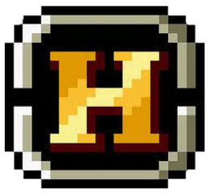
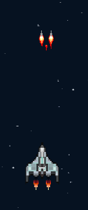
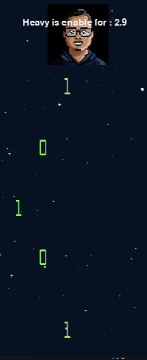

# Spaceship-Game-CO-5-2023(miguel barrios perez)
<h1 align="center" >  SPACESHIP GAME </h1>

hola, soy miguel barrios, el "creador" de este juego que se fue desarrollando en gran medida durante las clases utilizando la libreia de pygame.org 

 

al entrar se encuentra con un boton play y audios(cancion del juego) que te dan la bienvenida al precionar inicia el juego 

 

<audio controls  autoplay ><source src="game/assets/music/teme.wav" type="audio/wav"> </audio>
 
<h3>  </h3>
 
<h1 align="center"> powers for spaceship </h1>
<h5 align="center"> estos aparecen a lo largo del juego, aleatoriamente y dan distintos buffos dependiendo de que utilices </h5>
c

 

 esta le agrega disparos especiales por tiempo limitado, que aumentan el daño x2 

 
<h3 align="center" > heart </h3>

 agreguega 1 mas de vida al player permanentemente 

 
<h3 align="center" > Shield </h3>

 

 inmune a daño durante tiempo limitado 
 
<h1 align="center"> SONIDOS </h1>
<h3 align="center" >los elementos a los que se le implemento el sonido son <h1>menu</h1><h1>disparo de spaceship</h1><h1>heavymachinegun</h1><h1>shield</h1><h1>muerte</h1> </h3>
<h1 align="center"> BOSS </h1> 

 El boss esta inspirado en mi compañero carlos monsalve 

 al aparecer el boss todos los enemigos cambian sus ataques a binarios y mientras este el bos vivo no pareceran mas enemigos, este boss consta de movimientos especiales y una vida maxima de 20 
 
 
<h1 align="center"> estadisticas </h1>

 se le agrego la estadistica de bosses asesinados 

